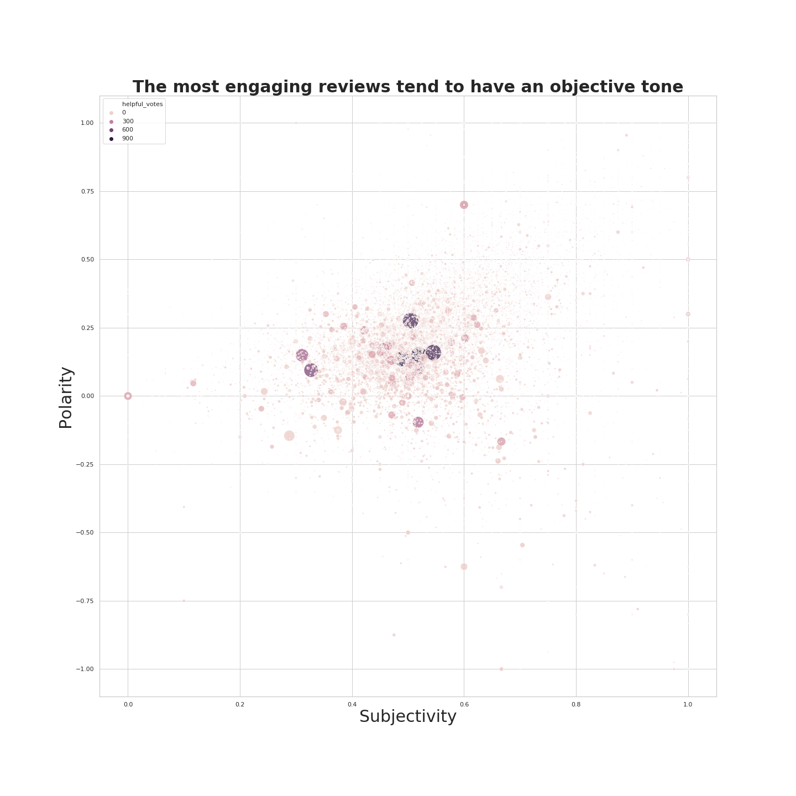

# Lambda School - DS2 - Data Storytelling

## Description

This notebook analyzes a 500k row random sample of the 6.2Gb Amazon Customer Review dataset. 
The dataset spans the years 1995 to 2015 and includes user product ratings, product reviews, 
and user votes given to each product review.

Using this data I analyzed which elements of a review engage and spur interaction between users
on Amazon. This kind of analysis is useful when you want to understand how and in which ways you
want to grow the community centered around your product. In this case, I used the features of
each review to undestand what made other users deem it 'helpful'.

The full description of the dataset can be seen below.



## Data Structure

You can see the full description page here: https://s3.amazonaws.com/amazon-reviews-pds/tsv/index.txt

```
DATA COLUMNS:
marketplace       - 2 letter country code of the marketplace where the review was written.
customer_id       - Random identifier that can be used to aggregate reviews written by a single author.
review_id         - The unique ID of the review.
product_id        - The unique Product ID the review pertains to. In the multilingual dataset the reviews
                    for the same product in different countries can be grouped by the same product_id.
product_parent    - Random identifier that can be used to aggregate reviews for the same product.
product_title     - Title of the product.
product_category  - Broad product category that can be used to group reviews 
                    (also used to group the dataset into coherent parts).
star_rating       - The 1-5 star rating of the review.
helpful_votes     - Number of helpful votes.
total_votes       - Number of total votes the review received.
vine              - Review was written as part of the Vine program.
verified_purchase - The review is on a verified purchase.
review_headline   - The title of the review.
review_body       - The review text.
review_date       - The date the review was written.
```

## Get the data

Amazon splits out it's book reviews dataset into 3 subsets, this project uses the first:
- https://s3.amazonaws.com/amazon-reviews-pds/tsv/amazon_reviews_us_Books_v1_00.tsv.gz
- https://s3.amazonaws.com/amazon-reviews-pds/tsv/amazon_reviews_us_Books_v1_01.tsv.gz
- https://s3.amazonaws.com/amazon-reviews-pds/tsv/amazon_reviews_us_Books_v1_02.tsv.gz


```bash
wget -L https://s3.amazonaws.com/amazon-reviews-pds/tsv/amazon_reviews_us_Books_v1_00.tsv.gz
```
